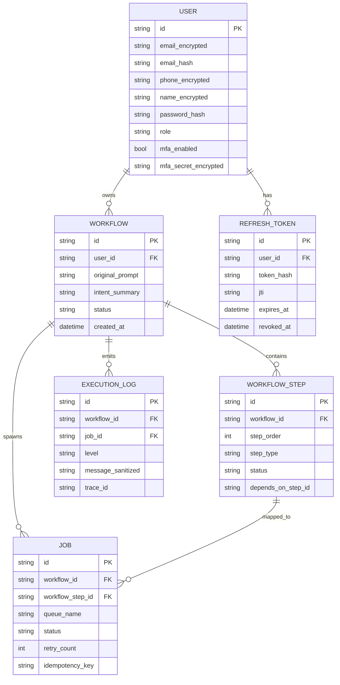

# ER Diagram

```mermaid
erDiagram
    USER ||--o{ WORKFLOW : owns
    USER ||--o{ REFRESH_TOKEN : has
    WORKFLOW ||--o{ WORKFLOW_STEP : contains
    WORKFLOW ||--o{ JOB : spawns
    WORKFLOW ||--o{ EXECUTION_LOG : emits
    WORKFLOW_STEP ||--o{ JOB : mapped_to

    USER {
      string id PK
      string email_encrypted
      string email_hash
      string phone_encrypted
      string name_encrypted
      string password_hash
      string role
      bool mfa_enabled
      string mfa_secret_encrypted
    }

    REFRESH_TOKEN {
      string id PK
      string user_id FK
      string token_hash
      string jti
      datetime expires_at
      datetime revoked_at
    }

    WORKFLOW {
      string id PK
      string user_id FK
      string original_prompt
      string intent_summary
      string status
      datetime created_at
    }

    WORKFLOW_STEP {
      string id PK
      string workflow_id FK
      int step_order
      string step_type
      string status
      string depends_on_step_id
    }

    JOB {
      string id PK
      string workflow_id FK
      string workflow_step_id FK
      string queue_name
      string status
      int retry_count
      string idempotency_key
    }

    EXECUTION_LOG {
      string id PK
      string workflow_id FK
      string job_id FK
      string level
      string message_sanitized
      string trace_id
    }
```
