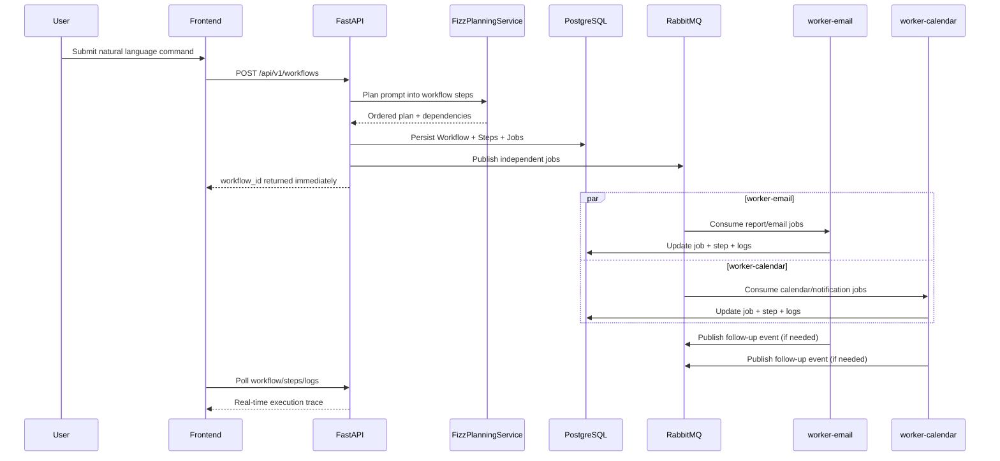

# Workflow Sequence

```mermaid
sequenceDiagram
    participant U as User
    participant F as Frontend
    participant A as FastAPI
    participant P as FizzPlanningService
    participant D as PostgreSQL
    participant Q as RabbitMQ
    participant W1 as worker-email
    participant W2 as worker-calendar

    U->>F: Submit natural language command
    F->>A: POST /api/v1/workflows
    A->>P: Plan prompt into workflow steps
    P-->>A: Ordered plan + dependencies
    A->>D: Persist Workflow + Steps + Jobs
    A->>Q: Publish independent jobs
    A-->>F: workflow_id returned immediately

    par worker-email
        Q->>W1: Consume report/email jobs
        W1->>D: Update job + step + logs
    and worker-calendar
        Q->>W2: Consume calendar/notification jobs
        W2->>D: Update job + step + logs
    end

    W1->>Q: Publish follow-up event (if needed)
    W2->>Q: Publish follow-up event (if needed)
    F->>A: Poll workflow/steps/logs
    A-->>F: Real-time execution trace
```
