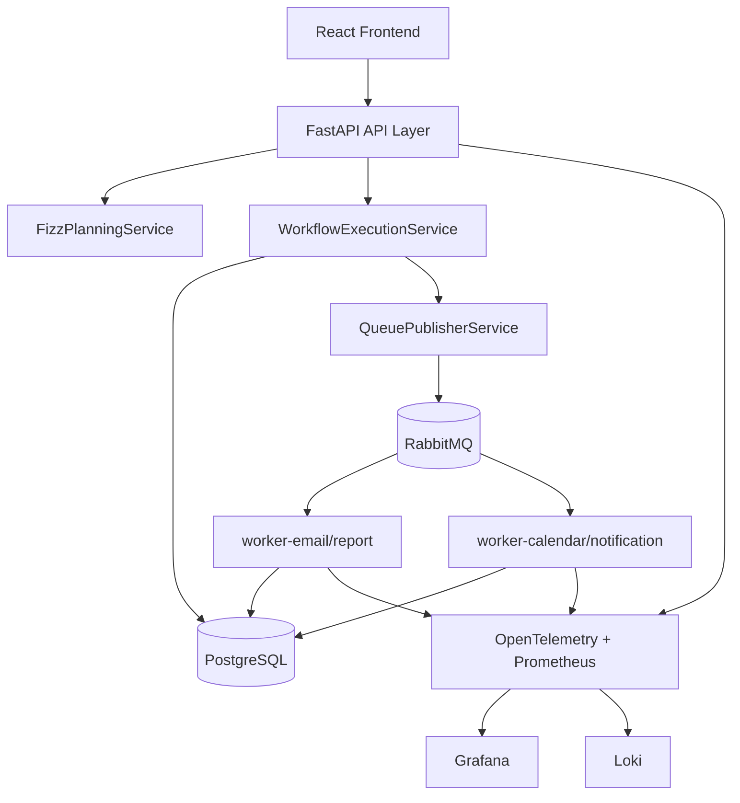

# System Architecture (Flowberry)

```mermaid
graph TD
    UI[React Frontend] --> API[FastAPI API Layer]
    API --> Planner[FizzPlanningService]
    API --> Exec[WorkflowExecutionService]
    Exec --> DB[(PostgreSQL)]
    Exec --> QPub[QueuePublisherService]
    QPub --> RMQ[(RabbitMQ)]

    RMQ --> WE[worker-email/report]
    RMQ --> WC[worker-calendar/notification]

    WE --> DB
    WC --> DB

    API --> OBS[OpenTelemetry + Prometheus]
    WE --> OBS
    WC --> OBS
    OBS --> GRAF[Grafana]
    OBS --> LOKI[Loki]
```
